# Aynı Zamanda

**Aynı sırada, dünyanın başka yerlerinde ne oluyordu?**

Bir bölgenin tarihini tek başına okumak, olayları birbirinden kopuk bir listeye çevirir. *Aynı Zamanda*, bu
soruyu kolay yanıtlamak için tasarlanmış, zamanı ön plana alan etkileşimli bir tarih haritasıdır. Kullanıcı iki şey
seçer: bir **zaman aralığı** (tek yıl, 5 yıl, 100 yıl; kararı kullanıcı verir) ve haritada bir **yer**.

- **Harita zamana bağlıdır ve herkes için aynıdır:** o dönemin siyasi sınırlarını ve dünyanın dört bir yanından bir
  olay seçkisini gösterir. Hangi yerin seçili olduğu haritanın *içeriğini* değiştirmez.
- **Zaman çizelgesi yere bağlıdır:** seçilen yerle doğrudan ilgili olayları, dünya tarihinde önemsiz olsalar bile,
  gösterir.

Bu ilk prototip, görsel dili ve etkileşimi oturtmak içindir; veri bilerek küçüktür (1400–1600, 72 olay).

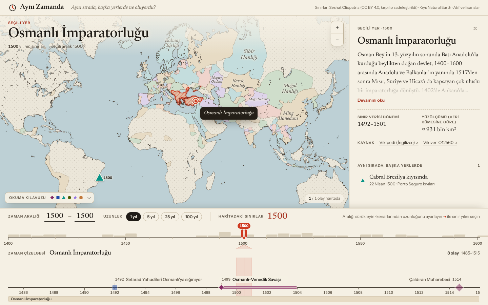

| Çin seçili, aynı harita | Aralık 1450–1500 | Olay ayrıntısı |
|---|---|---|
| 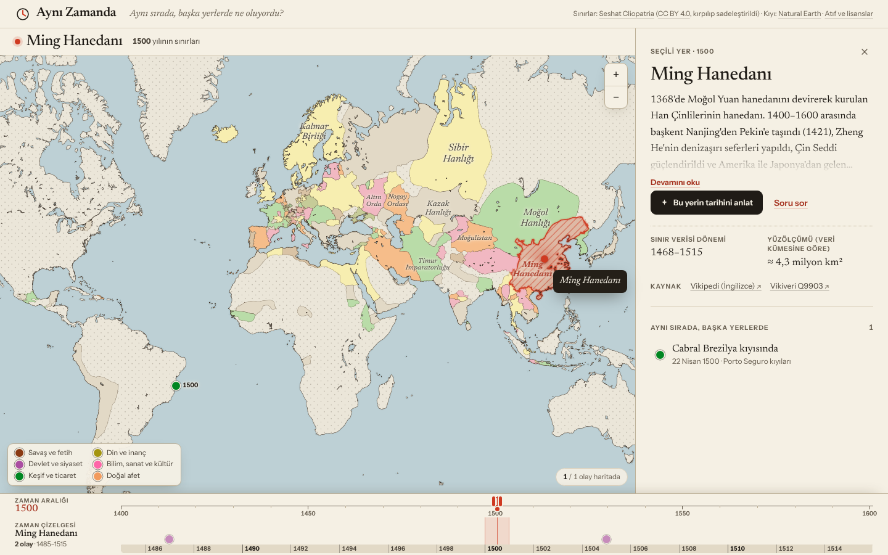 | 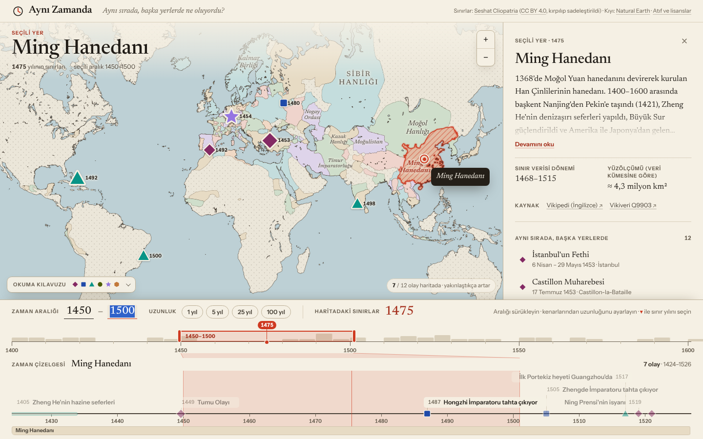 | 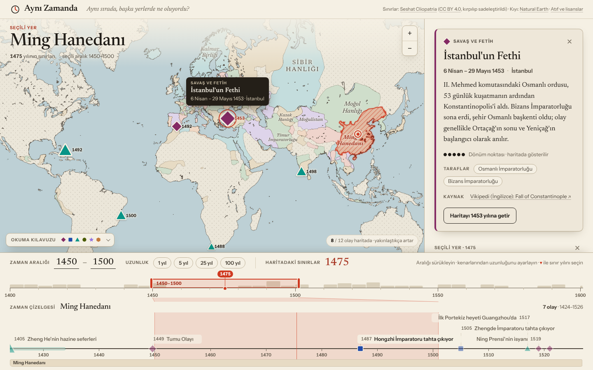 |

Çizelgeden görünüm dışındaki bir olay (Mohaç, 1526) seçilince harita yumuşakça, yalnızca gerektiği kadar uzaklaşır:

| Önce: Çin'e yakınlaşılmış | Sonra: Macaristan görünür, işaretçi vurgulu | Olay kapatılınca |
|---|---|---|
| 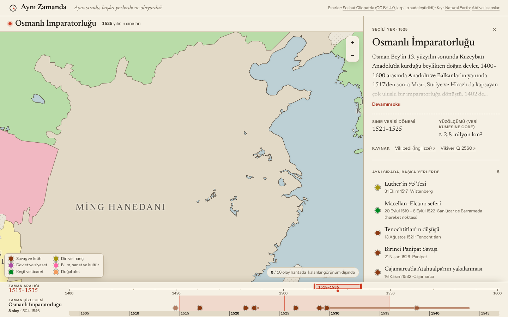 | 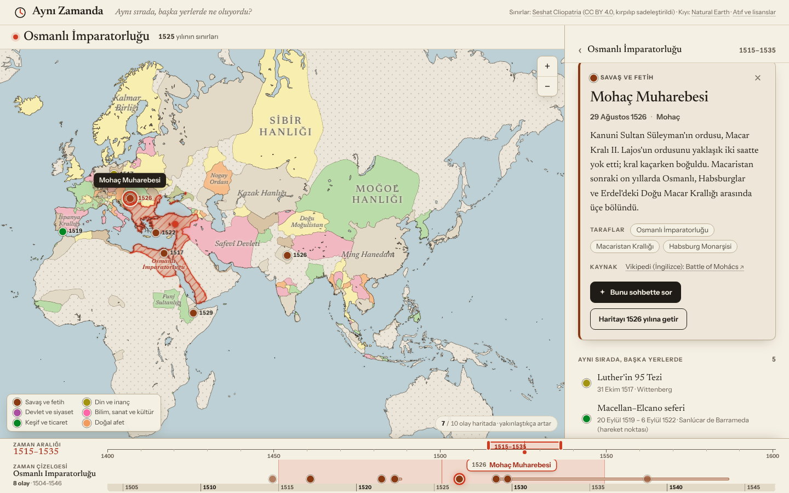 | 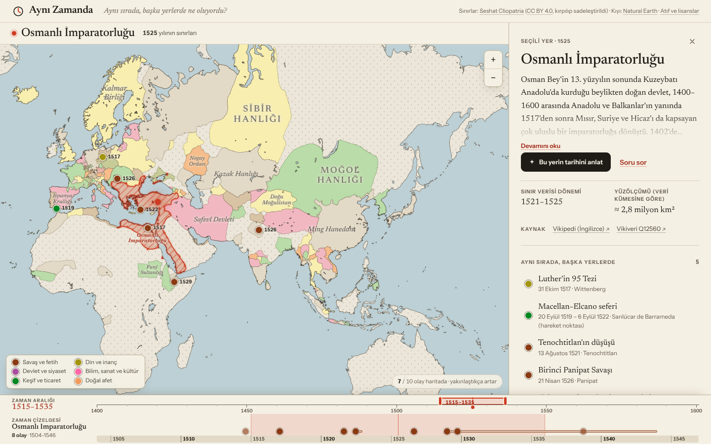 |

## Çalıştırma

En kolay yol **tek dosya sürümüdür**: sunucu da, kurulum da gerekmez.

```bash
npm install
npm run build:standalone   # → dist-standalone/ayni-zamanda.html (~11 MB)
```

`ayni-zamanda.html` dosyasını tarayıcıda açmak (çift tıklamak) yeterlidir. Betik, stil, yazı tipleri ve tüm veri dosyanın
içindedir; hiçbir ağ isteği yapmaz, çevrimdışı çalışır ve her statik barındırmaya tek dosya olarak yüklenebilir.
(`ayni-zamanda.fragment.html`, kendi `<html>` kabuğunu ekleyen barındırıcılar için aynı sayfanın gövdesidir. Bu sürümde
"Atıf ve lisanslar" bağlantısı, dosyanın yanında NOTICE.txt olmadığı için depodaki dosyaya gider.)

Geliştirme için:

```bash
npm install
npm run dev          # http://127.0.0.1:5173
npm run build && npm run preview
npm test             # birim testleri + veri doğrulaması
npm run e2e          # gerçek tarayıcıda kabul senaryosu (aşağıya bakın)
npm run e2e:ai       # okuma arkadaşı (sohbet) için aynısı, komut dosyalı modelle
npm run data:validate
```

Gerekenler: Node 20.19+ (22 önerilir). Veri hattını yeniden çalıştırmak için ayrıca Python 3 ve `shapely` gerekir;
uygulamanın kendisi Python'a ihtiyaç duymaz, çünkü üretilen veri depoda durur.

## Kullanım

| Ne yapmak istiyorsunuz | Nasıl |
|---|---|
| Zaman aralığını seçmek | Alttaki cetvelde aralık çubuğunu sürükleyin; kenarlarından sürükleyerek uzunluğunu ayarlayın; boş yere tıklarsanız aralık oraya taşınır. Başka denetim yoktur (yıl kutusu, hazır süre düğmesi yok). Klavyeyle: çubukta `←/→` 1 yıl, `Shift` ile 10 yıl, `Home/End` uçlara |
| Haritada hangi yılın sınırlarının çizildiğini seçmek | Aralığın içindeki küçük işareti (çizgi + nokta) sürükleyin (varsayılan: aralığın ortası). Seçili yıl, haritanın üstündeki başlıkta "… yılının sınırları" notunda yazar |
| Bir yeri seçmek | Haritada bir devletin üzerine tıklayın. **Harita yerinden oynamaz**: yalnızca sürükleme, tekerlek, çimdik ve `+/−` düğmeleri haritayı hareket ettirir (istisnalar aşağıda: görünüm dışındaki bir olayı açmak; sohbet açıkken, siz açık tutarsanız, *Harita takibi*) |
| Bir olayı okumak | Haritadaki işaretçiye, çizelgedeki noktaya ya da sağdaki listeye tıklayın (sohbet açıkken olay işaretçileri haritadan çekilir: çizelgeden tıklayın, işaretçisi haritaya gelir). Çizelgede olay adları kalıcı yazılmaz: noktanın üstüne gelince (dokunmatikte dokununca) adı görünür; açık olayın adı noktasının yanında kalır. Klavyeyle: `Tab` ile işaretçi grubuna girin, ok tuşlarıyla işaretçiler arasında gezinin, `Enter` ile açın (odak olay kartına gider) |
| Olaydan yer görünümüne dönmek | Panelin üstündeki tek satırlık yer başlığına tıklayın (ad + aralık), olay kartında ✕'e basın ya da `Esc` |
| Seçimi kaldırmak | Panelde ✕ ya da `Esc` (önce açık olayı, ikincisi yeri kapatır) |

**Açık olay her zaman haritadadır.** Çizelgeden ya da listeden bir olay açtığınızda işaretçisi, yakınlaştırma bütçesi veya
eleme yüzünden normalde çizilmeyecek olsa bile, çizilir ve belirgin biçimde vurgulanır (kalın vermilyon halka, ışıma,
adı yanında). Yeri o anki görünümün dışındaysa harita, yeri görünene kadar **yalnızca uzaklaşır** (kaydırmak yerine
uzaklaşmak tercih edilir; önceki görünüm yeni görünümün içinde kalır) ve bunu sıçramadan, yumuşakça yapar. Zaten görünen
bir olayı açmak (örneğin kendi işaretçisine tıklamak) haritayı hiç oynatmaz.

Adres çubuğu durumu taşır (`#t=1450-1500&p=32.85,39.93&e=...`), bu yüzden bir görünümü bağlantıyla paylaşabilirsiniz.
Harita kamerası (`v=yakınlaştırma/enlem/boylam`) adrese yalnızca siz haritayı kendiniz oynattıktan sonra yazılır; açılıştaki
otomatik çerçeve herkes için aynıdır ve bağlantıya girmez. Bozuk ya da yarım bir bağlantı (ör. `p=32.85,`) yok sayılır;
uygulamayı çökertmez. Fare olan cihazlarda tekerlek haritayı yakınlaştırır (dar pencerede de); dokunmatik ekranlarda sayfa
kaydırması ile harita hareketi karışmasın diye harita iki parmakla gezilir.

## Okuma arkadaşı: haritayla birlikte okuyan sohbet

Panelin yerini bir **sohbet** alabilir (yer kartındaki *Bu yerin tarihini anlat* / *Soru sor*, açılış kartındaki *Sohbeti aç*).
Şimdiye kadarki uygulama sohbetin **bağlam seçicisidir**: seçili yer, zaman aralığı ve açık olay modele kendiliğinden gider; harita
ise model anlatırken üzerine çizdiği şeydir. Şu an çalışanların hiçbiri değişmedi: harita yine yalnızca zamana, zaman çizelgesi
yine yalnızca seçili yere bağlıdır.

| Anlatım: adımlar, her adımın kendi harita durumu | Soru: tek yanıt, tek harita durumu |
|---|---|
| 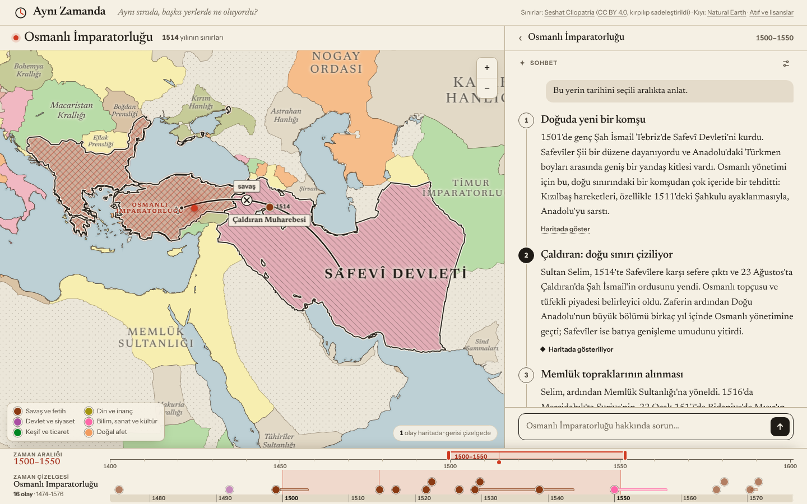 | 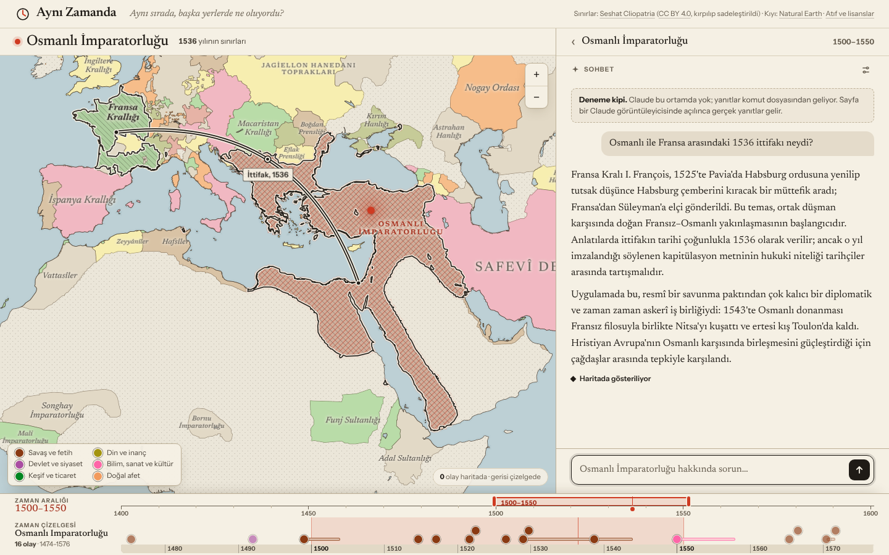 |

| Her adım yalnızca kendi çizimini gösterir. 3. adım: Memlük; Ridaniye olayın kendi işareti, Mercidabık verinin bilmediği yer (serbest işaret) | 4. adım: Mohaç ve Viyana kendi işaretleriyle; kamera çizime kaydı; etiketler birbirini örtmüyor |
|---|---|
| 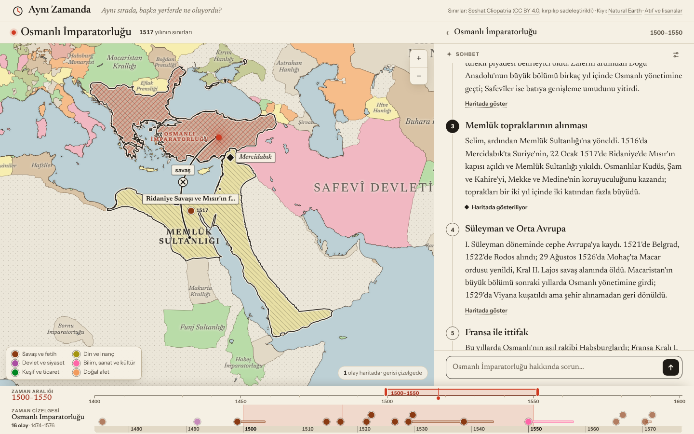 | 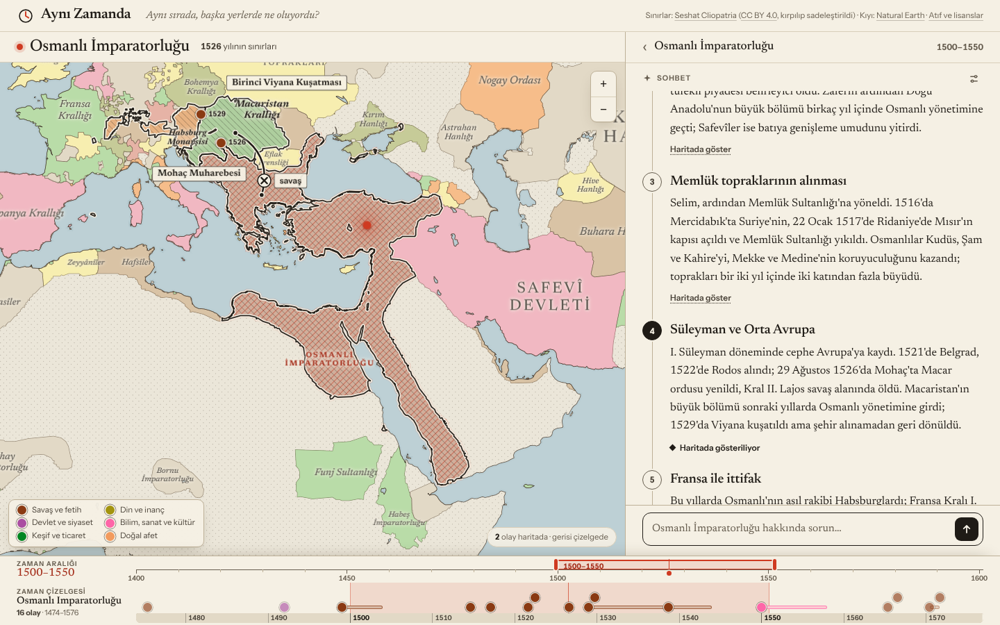 |

| Harita takibi: büyük bir gezintiden sonra küçük soru | Soru ayarın yerini gösterir: *Ayarlar ⚙ → Harita takibi* |
|---|---|
| 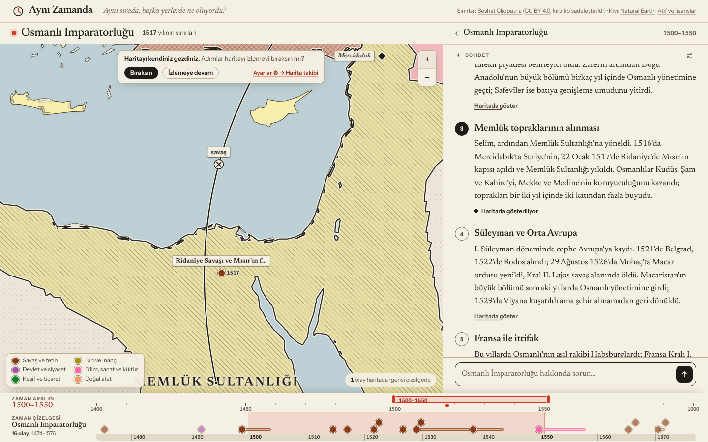 | 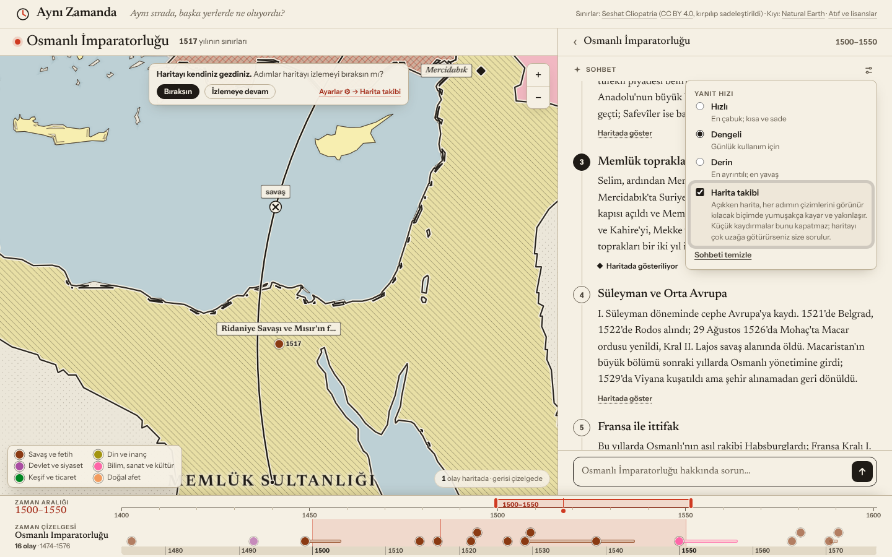 |

| Olay kartı sohbetin üstünde, *Bunu sohbette sor* | Yer değişince sohbet bunu söyler |
|---|---|
| 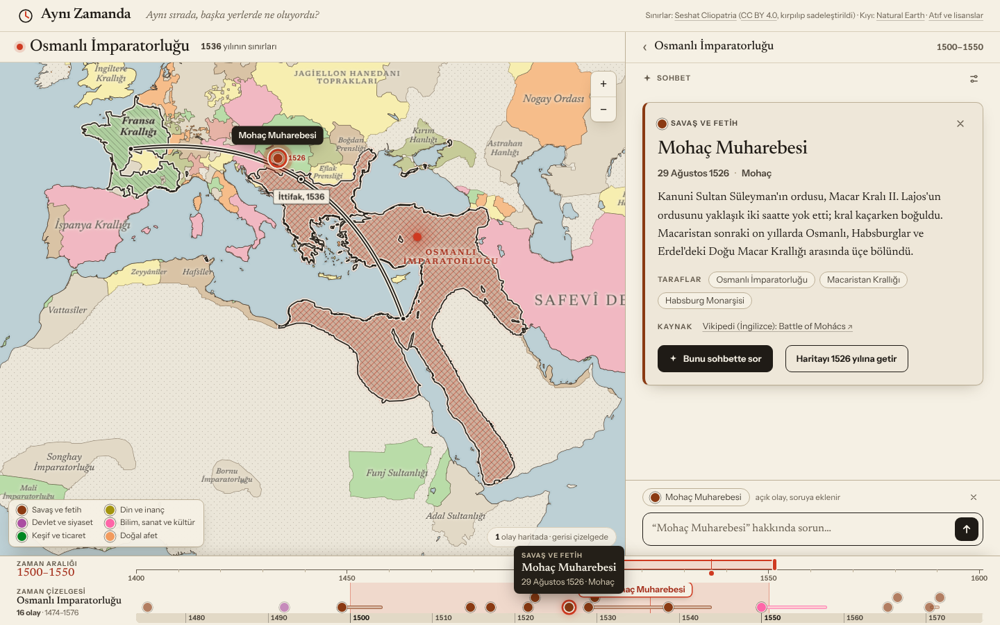 | 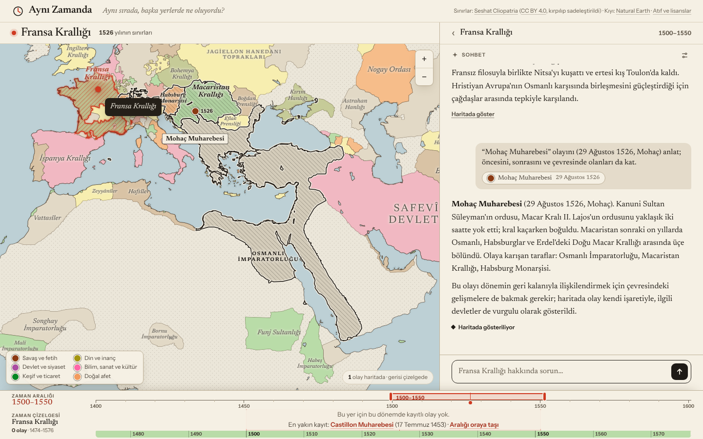 |

**Nasıl çalışır**

- **Anlatım.** *Bu yerin tarihini anlat* yanıtı paragraf boyutunda numaralı adımlara böler (`## 1. Başlık`). **Her adım haritanın
  sahibidir:** etkin adım haritada yalnızca kendi çizimlerini gösterir (devlet vurguları, bağlantılar, olay işaretçileri, işaretler,
  sınır yılı); bir önceki adımın çizimleri gider, geri dönülünce o adımın çizimi aynen gelir. Hiçbir adım ötekinden bir şey devralmaz
  (yıl dahil: yıl istemeyen adımda yıl okurun kendi imlecidir); bu yüzden model her adımda gereken her şeyi kendisi bildirir ve
  `clear` diye bir araç yoktur. Okurken, gözün altındaki adım (ekranın biraz üstündeki "okuma çizgisi") etkin olur ve harita onun
  durumuna geçer. Fareyle gezmeyenler için her adımda *Haritada göster* düğmesi vardır.
- **Soru.** Serbest soruların her yanıtı tek bir adım, yani tek bir harita durumudur.
- **Panel.** Sohbet panelin yerini alır (yer kartının yanına değil). Yer, olay açıkken kullanılan aynı tek satırlık başlığa (ad + aralık)
  küçülür; başlık konuşmanın neyle ilgili olduğunu söyler, tıklanınca bir önceki görünüme (olay sayfası → sohbet → yer kartı) döner.
  Sohbet sırasında bir olaya (harita ya da çizelge) tıklanırsa olay kartı **sohbetin üstünde** açılır; kapatınca aynı sohbete,
  aynı okuma konumuna dönülür. Karttaki *Bunu sohbette sor* olayı konuşmaya gönderir. Sohbet açılırken panel tek ve yumuşak bir
  hareketle genişler (410 → 540 px); harita **kıpırdamaz**: yalnızca sağdan örtülür, sonda bir kez, sol kenarı sabit tutularak
  yeniden boyutlanır.
- **Bağlam.** Model her soruyla birlikte seçili yeri (o yıldaki devleti ve aralıktaki egemenlerini), aralığı, haritadaki yılı, açık
  olayı, aralıkta sınır verisinde bulunan devletlerin listesini (kimlik | ad) ve uygulamanın olay kayıtlarını alır. Bağlam bir **yer
  listesidir** ve her yerin kendi aralığı vardır (bugün hepsi seçili aralık; birden çok yer ya da dönem haritaya bir şey
  koymadan, sohbetin kendisinden gelecek: okur sorusunda başka bir yeri ya da dönemi anacak). Sohbet sürerken
  yer ya da aralık değişirse sohbette bir **"Bağlam değişti"** ayırıcısı (eski → yeni) çıkar; okur eski konuya dönerse kalkar; model de
  bir sonraki istekte bunu bir cümleyle öğrenir. Yıl imlecini oynatmak ya da bir olay açmak "yeni konu" sayılmaz.
- **Haritaya çizim, yalnızca araç çağrılarıyla** (altı araç): `highlight` (devlet vurgusu), `connect` (savaş / ittifak / ticaret /
  antlaşma çizgisi, isteğe bağlı kısa etiket), `show_event` (uygulamanın bir olayını **kendi işaretçisiyle** göstermek), `mark`
  (koordinat + kısa etiket), `set_year` (seçili aralığın içinde) ve adımları bildiren `step`. Çizimler **mürekkep ve kâğıt**
  dilindedir: veri katmanlarıyla aynı görsel dil ama onlardan ayrı (vurgu = mürekkep kenar + ters yönde ince tarama; savaş = kalın
  çizgi ve ×, ittifak = çift çizgi, ticaret = kesikli ve çift oklu, antlaşma = noktalı ve ◇; serbest işaret = mürekkep eşkenar
  dörtgen ve etiket). Renk kullanılmaz: vermilyon yalnızca okurun seçimidir, olay noktaları kendi renklerini korur. Modelin yazdığı
  her başvuru verideki bir şeye çözülmek zorundadır (devlet kimliği ya da adı, olay kimliği ya da adı, haritanın içinde bir
  koordinat, aralığın içinde bir yıl); çözülmeyen çizim **sessizce atlanır** (yalnızca modele "atlandı" denir).
- **Haritada tek anlatıcı.** Sohbet açıkken haritayı yapay zekâ anlatır: **olay işaretçileri haritadan çekilir** (hepsi çizelgede
  durur; sayaç "0 olay haritada · gerisi çizelgede" der). Bir olay haritaya iki yoldan gelir: okur çizelgeden tıklar (kartı açık
  kaldığı sürece işaretçisi haritadadır) ya da etkin adım ondan söz eder. Anlatılan şey uygulamanın verisinde bir olaysa model işaret
  çizmez, `show_event` der ve haritada **olayın kendi işaretçisi** (yıl yazılı, adı yanında; tıklanınca kartını açar) belirir. `mark`
  yalnızca verinin bilmediği yerler içindir (bir kent, geçit, liman). Model yine de verideki bir olayı `mark` ile çizerse (aynı yer
  adı ya da olay adı, olayın yerine ≤ 60 km, aralıkta tek eşleşme) sayfa onu olayın kendi işaretçisine çevirir ve modele bunu söyler:
  haritada aynı şey için iki işaret olmaz. Modele olaylar kimlikleriyle (`OLAYLAR` listesi) verilir. Sohbet kapanınca haritanın
  olayları eskisi gibi geri gelir; sohbet dışında hiçbir şey değişmedi.
- **Kamera: Harita takibi.** Açıkken (varsayılan) her adım etkin olduğunda harita o adımın çizimlerini **görünür kılar**: vurgulanan
  devletlerin ana parçaları, bağlantı uçları, işaretler ve olaylar birlikte, gerektiği kadar kayarak *ve* yakınlaşıp uzaklaşarak,
  yumuşakça (0,8–2,4 sn), harita kontrollerinin altında kalmadan (`MapView.frameTarget`, `domain/camera.ts`). Çizim zaten iyi
  çerçevedeyse (hepsi görünür, ortada, uygun ölçekte) harita oynamaz: aynı bölgedeki iki adım haritayı "nefes aldırmaz". Hiçbir
  araç kamerayı oynatmaz; takip sayfanın işidir (modele `focus` yok). Okurun **küçük** hareketleri takibi kapatmaz: haritanın kısa
  kenarının üçte birinden az kaydırma, bir kez `+`/`−`. **Önemli** bir harekette (üçte bir ya da daha çok kaydırma, ya da `+/−` ile
  bir buçuk düzeyden çok; hareketler sayfanın bıraktığı kameradan itibaren toplanır) haritanın üstünde küçük bir soru çıkar:
  *Haritayı kendiniz gezdiniz. Adımlar haritayı izlemeyi bıraksın mı?* (*Bıraksın* / *İzlemeye devam*), yanında ayarın yeri:
  **Ayarlar ⚙ → Harita takibi** (tıklanınca ayarlar açılır ve satır işaretlenir). Soru iletişim kutusu değildir: odağı çalmaz,
  haritanın %6'sından azını kaplar (dar bir telefon haritasında beşte birinden azını, yakınlaştırma düğmelerinin ve sayacın altında kalmadan), cevaplanmazsa kendiliğinden kalkar (hiçbir şeye karar vermeden) ve "İzlemeye devam" denirse o
  sohbette bir daha sorulmaz. Takibi yalnızca okurun cevabı ya da ayar kapatır; kapalıyken adımlar çizimi değiştirir ama haritayı
  oynatmaz ve sohbetin üstünde "Harita takibi kapalı · aç" çipi durur. Yapay zekânın istediği **yıl**, okurun kendi imlecinin üstüne
  biner (imleç değişmez); okur imleci ya da aralığı oynatırsa bir sonraki adıma kadar kendi yılı geçerlidir. Sohbet kapanınca
  çizimler haritadan kalkar, geri açılınca etkin adımın durumu geri gelir.
- **Etiketler birbirini örtmez.** Yapay zekâ etiketleri (bağlantı adı, serbest işaret adı, olay adı) işaretçileri, yer noktasını,
  haritanın kontrollerini, kendi çizimlerinin simgelerini ve devlet adlarını engel sayarak yerleşir (`src/map/flags.ts`): önce
  noktasının dört yanını, sonra daha uzak yerleri dener (bir bağlantının etiketi çizgisi boyunca kayar); hiçbir boş yer yoksa altındaki
  devlet adı çekilir (vurgulananların adı çekilmez: onlar işaretçiden, olabildiğince az kayarak uzaklaşır). Bağlantı simgesi (×, ◇…)
  de bir işaretçinin altında kalmaz, çizgisi boyunca kayar. `npm run e2e:ai` bunu sayfada ölçer (her adım, üç kamera, iki ekran boyu).

**Model: `sample` yeteneği, anahtar yok.** Uygulama bir Claude artifact'ı olarak yayınlanır ve artifact çalışma zamanının `sample`
yeteneğini (`const sample = await claude.use("sample")`) kullanır: çağrı **okurun kendi Claude hesabına** gider, ilk çağrıda okurdan
izin istenir, yanıt `onText` ile akar, harita eylemleri sayfa işlevleri (`tools`) olarak verilir. Bu yüzden sistem istemi yoktur
(yönergeler ve bağlam baştaki bir kullanıcı turundadır), çağrılar belleksizdir (sayfa sohbet geçmişini kendisi tutar ve her çağrıyla
yollar; 256 KiB sınırı için en eski karşılıklar atılır), sayfanın ağı yoktur (modelin kendi bilgisi + uygulamanın olay kayıtları;
canlı Vikipedi yok). Hız: **Hızlı / Dengeli / Derin** (`modelTier`: quick / default / complex; model adı hiçbir yerde yok; seçim
tarayıcıda saklanır). `not_granted`, `rate_limited`, `tools_unavailable`, `cancelled` ve diğer kodlar sohbette, yazıldıkları yerde
Türkçe olarak gösterilir; **hiçbir hata kendiliğinden yeniden denenmez** (yalnızca okur *Yeniden dene*'ye basarsa). Yanıt sürerken
**Durdur** vardır; metin ilk kez gelene kadar "Düşünüyor…" yazar.

**Tur sayısı az olsun diye iki turlu bir protokol.** Her araç turu ayrı bir (ücretli) istektir ve araç girdileri akmaz. Bu yüzden
model **birinci turda, metin yazmadan, tek seferde** adımları (`step{n, title}`) ve her adımın çizimlerini (`step` numarasıyla) bildirir;
**ikinci turda** yalnızca metni yazar (`## n. Başlık` + paragraf), metin akarken okur okumaya başlar ve ilk adımın haritası hazırdır.
Sayfa metni adımlara ayırır (başlık işaretini, numarayı ve boşluğu bağışlayıcı biçimde okur; başlıksız ama paragraf sayısı adım
sayısına eşit metni de adımlara dağıtır). Araç yoksa (`limits()` raporlamazsa ya da `tools_unavailable` gelirse) aynı soru yalnızca
metin olarak sorulur ve sohbet bunu söyler.

**Claude olmayan yerde: deneme kipi.** `claude.use("sample")` boş dönerse (yerel geliştirme, kaydedilmiş dosya, başka bir ev sahibi)
sohbet **komut dosyalı bir sağlayıcıya** düşer ve bunu açıkça yazar ("Deneme kipi"). Komut dosyalı sağlayıcı gerçek bir çağrının
yaptığını yapar: düşünür, birinci turdaki araç çağrılarını gerçekten çalıştırır, metni parça parça akıtır. Osmanlı anlatımı, Fransa
ittifakı sorusu ve açık olay sorusu için hazır yanıtları vardır; geri kalan her yer ve aralık için yanıtı uygulamanın kendi verisinden
(yerin egemenleri, olay kayıtları) üretir. Soru metnine `[hata:rate_limited]` gibi bir işaret eklemek hata ekranlarını görmek için
o hatayı üretir.

**Kaynaklar.** Varsayılan kaynak modelin kendi bilgisidir; uygulamanın doğrulanmış olay kayıtları ilgili dönem ve yer için isteme
eklenir (modelin kartlarla çelişmemesi için). `src/ai/sources.ts` içindeki `SourceProvider` arayüzü ileride okurun yüklediği bir kitap
gibi kaynakların takılacağı yerdir: `retrieve({ question, context })` metin parçaları döndürür, gerisi değişmez. Model de küçük bir
arayüzün (`ModelProvider`) arkasındadır: gerçek `SampleProvider` ve komut dosyalı `MockProvider`.

**Henüz yok:** yüklenmiş belge kaynağı. Birden çok yerin bağlamı sohbetin kendisinden gelecek (okur başka bir yeri ya da dönemi
anınca). Bağlamın şekli (yer listesi, yer başına aralık) ve `SourceProvider` bunlar için ayrılmıştır.

## Tasarım kararları ve gerekçeleri

| Karar | Gerekçe |
|---|---|
| **MapLibre GL JS** (vektör, GPU) | Sürükleme/yakınlaştırma akıcı olmalı; sınırlar, vurgu ve katmanlar tek bir yerde çizilebilsin. Dış karo sunucusuna ihtiyaç yok: harita tamamen kendi verimizden çizilir. |
| **Vite + TypeScript + lit-html** (React yok) | Arayüz küçük ve durum odaklı; bir bileşen çerçevesi gereksiz. Mantık (`src/domain`) arayüzden ayrıdır ve birim testlidir. |
| **Sınır verisi: Seshat Cliopatria** (CC BY 4.0) | 1400–1600 arasında devletler için 5–20 yıllık kayıt dönemleriyle, çoğunlukla aralıksız sınır verir (yıl yıl seçilebilir); zaman sürükleyince sınırlar gerçekten kayar. Alternatif `historical-basemaps` bu aralıkta yalnızca 5 anlık görüntü (1400, 1492, 1500, 1530, 1600) sunuyor ve GPL-3.0. Cliopatria ayrıca her devlet için Wikipedia/Wikidata kimliği ve üst-alt (ör. Brandenburg → Kutsal Roma) ilişkisi taşır. Bedeli: yalnızca devletleri haritalar; devlet kaydı olmayan karalar noktalı "veri yok" zemini olarak gösterilir. |
| **Yer = bir nokta, devlet = o noktanın o yıldaki sahibi** | Konya 1450'de Karamanoğulları, 1475'te Osmanlı'dır. Zaman çizelgesi, aralık boyunca o noktayı elinde tutan *tüm* devletlerin (ve üst yapılarının, bulunduğu bölgenin) olaylarını toplar; böylece "yerin tarihi" okunur. |
| **Haritadaki olay sayısı: yakınlaştırma bütçesi; önem yalnızca eleme için** | Her olayın içsel bir önem puanı (1–5) vardır, ama arayüz bunu **göstermez** (boyut, rozet, etiket yok): neyin önemli olduğuna kullanıcı karar verir. Puan yalnızca kalabalığı ayıklar: haritada yalnızca puanı ≥3 olanlar yer alır (daha yerel olanlar yalnızca çizelgededir); bütçe *görünümdeki* olaylara harcanır (dünya görünümünde az, yakınlaştıkça o bölgenin daha fazlası) ve ekranda çakışanlardan puanı düşük olan elenir. Sağ alttaki not kaç olayın çizildiğini ve geri kalanının neden görünmediğini söyler. |
| **Açık olay bu elemenin dışındadır, görünüm en az değişir** | Açık olay, bütçeye, önem süzgecine ve çakışmaya bakılmadan çizilir. Görünüm dışındaysa harita merkezi etrafında *yalnızca uzaklaşır* (Web Mercator'da merkezden uzaklık her yakınlaştırma düzeyinde yarıya iner; bu yüzden gereken en az düzey doğrudan hesaplanır, `domain/reveal.ts`) ve kontrollerin (`+/−`, lejant, sayaç) arkasında kalmamasına dikkat edilir. |
| **Aralık seçici: yalnızca cetvel** | Tek yıl da 100 yıl da aynı denetimle seçilir; sayı kutusu ya da hazır süre düğmesi yoktur. Fırçanın içindeki işaret, o aralık içinde hangi yılın sınırlarının çizileceğini seçtirir; seçilen yıl harita başlığının yanındaki notta görünür. Alt bölüm bu yüzden iki ince satırdır (≈ 100 px). |
| **Yer başlığı haritanın üstündedir, haritanın içinde değil** | Başlık ve "… yılının sınırları" notu, haritanın üstündeki sabit yükseklikli bir şeritte durur; hiçbir sınırı ya da işaretçiyi örtemez ve adın uzunluğu haritayı yeniden boyutlandırıp kaymış gibi göstermez. |
| **Bilgi paneli seçimlerle yönlenir: yer bağlam, olay odak** | Panel, `{ type: 'place' \| 'event', id }` başvurularının listesini kartlara çevirir. Yalnızca yer seçiliyse panel yeri anlatır; olay açıksa olayı anlatır ve yer tek satırlık bir başlığa (ad + aralık) küçülür; başlığa tıklamak ya da olayı kapatmak yer görünümüne döndürür. Hiçbir yerde "bir yer kartı + bir olay kartı" sabit düzeni yoktur. |
| **Çizelge, aralığın biraz ötesini soluk gösterir** | Tek yıllık bir seçimde bile yerin komşu yıllardaki olayları okunur; aralığın içindekiler vurgulu, dışındakiler soluktur. Çakışan noktalar (en çok 3 sıra) üst üste biner ama hiçbiri düşürülmez; her olay gerçek tarihinde çizilir. |
| **Düzen sabittir** | Bir yer seçilince başlık şeridinin, alt bölümün ya da panelin boyu değişseydi harita yeniden boyutlanır ve kaymış gibi görünürdü. Boyutlar durumdan bağımsızdır. |

### Görsel dil

Basılı bir atlas: sıcak kâğıt, kahverengi-siyah mürekkep, sakin pastel devlet dolguları ve **tek canlı renk**
(vermilyon): "seçtiğiniz şey". Seçili yer halkasız, dolu kırmızı bir nokta ve çevresinde yarıçapsal sönen yumuşak bir
ışımadır; seçili devlet taramalı çizilir; açık olay vermilyon halkayla vurgulanır. Devlet dolgularının rengi yalnızca
komşuları ayırır (derleme sırasında komşuluk grafiği boyanır; kimlik etiket ve sınırla taşınır) ve **hiçbiri mavi, turkuaz ya
da mor değildir**: haritada mavi yalnızca deniz ve göllere aittir (`tests/palette.test.ts` bunu sayıyla korur). Yazı: okuma
metinleri ve başlıklar için **Newsreader**, denetimler için **Instrument Sans**; ikisi de uygulamayla paketlenir.

**Olay işaretçileri haritada, çizelgede, lejantta ve panelde aynı tek işarettir:** aynı şekil (daire), aynı boyut (13 px);
yalnızca renk değişir ve renk kategoriyi anlatır. Boyut önemi anlatmaz. Altı kategori rengi bir renk-ayırt-edilebilirlik
doğrulayıcısından (OKLab ΔE, tüm çiftler, kâğıt zemin) geçirilmiştir: normal görüşte en kötü çift ΔE 15,0; protan/deutan
simülasyonunda en kötü çift ΔE 7,7. Bu değer doğrulayıcının 6–8 "uyarı" bandındadır ve yalnızca ikinci bir kanalla geçerlidir:
lejant, ipucu ve olay kartı kategoriyi **sözle** de söyler. Üç rengin (zeytin sarısı, pembe, turuncu) kâğıda karşı kontrastı
3:1'in altındadır; bu yüzden her noktanın çevresinde kâğıt halkası ve ince mürekkep çizgisi vardır. Lejant başlıksızdır, açılır-kapanır
değildir, haritanın sol alt köşesinde durur ve yalnızca bu altı rengi açıklar.

## Veri

```
public/data/
  borders/cliopatria-1400-1600.json   sınırlar (üretilmiş; elle düzenlenmez)
  borders/polities.json               devlet başına türetilmiş bilgiler (Wikipedia/Wikidata, ton, dönem)
  geo/land.json                       kıyı çizgisi / kara (Natural Earth, üretilmiş)
  entities.json                       DEVLET VE BÖLGE ADLARI + ÖZETLER (Türkçe, elle yazılır)
  categories.json                     olay kategorileri
  events/index.json                   hangi olay dosyalarının yükleneceği
  events/*.json                       OLAYLAR (Türkçe, elle yazılır)
  schema/events.schema.json           olay dosyası için JSON şeması (editörde otomatik tamamlama)
```

### Sınırları yeniden üretmek

```bash
python3 -m venv .venv && .venv/bin/pip install -r scripts/pipeline/requirements.txt
.venv/bin/python -I scripts/pipeline/fetch_sources.py        # Cliopatria (46 MB) + Natural Earth → .cache/
.venv/bin/python -I scripts/pipeline/build_borders.py --from 1400 --to 1600
```

Betik: parantezli "şemsiye" kayıtları çizmez (bileşenlerinin birleşimidir); poligonları kıyıya kırpar (kıyı
net olur, denize tıklamak hiçbir şey seçmez); komşuluk grafiğiyle devlet tonlarını boyar; etiket noktalarını
hesaplar. **Zaman aralığını genişletmek** için `--from/--to` değiştirilip betik yeniden çalıştırılır; arayüz
aralığı dosyadan okur.

### Olay eklemek (kod değişikliği gerekmez)

`public/data/events/` altındaki bir dosyaya (ya da yeni bir dosyaya, `index.json`'a ekleyerek) bir nesne eklemek yeter:

```json
{
  "id": "istanbul-fethi-1453",
  "title": { "tr": "İstanbul'un Fethi" },
  "summary": { "tr": "II. Mehmed komutasındaki Osmanlı ordusu, 53 günlük kuşatmanın ardından …" },
  "date": { "start": "1453-04-06", "end": "1453-05-29" },
  "location": { "name": { "tr": "İstanbul" }, "coordinates": [28.94, 41.01] },
  "importance": 5,
  "category": "military",
  "parties": ["ottoman-empire", "byzantine-empire"],
  "sources": [{ "wikipedia": "Fall of Constantinople" }]
}
```

- `date`: `"1453"`, `"1453-05"`, `"1453-05-29"` ya da `{ "start", "end", "approximate" }`.
- `importance`: 5 dönüm noktası · 4 çok önemli · **3 önemli (haritada görünür)** · 2 yerel önem · 1 yerel ayrıntı (yalnızca çizelge).
- `parties`: `entities.json` içindeki devlet/bölge kimlikleri. Olay, bu tarafların çizelgesinde **mesafeden
  bağımsız** görünür. Bir "üst yapı" taraf olarak yazılırsa (ör. `holy-roman-empire`), üyelerinin (Saksonya,
  Bavyera…) çizelgesinde de görünür.
- `sources`: en az bir Vikipedi makalesi (`wikipedia`, varsayılan dil `en`), Vikiveri kimliği (`wikidata`, `Q123` biçimi)
  ya da `url` (yalnızca `http(s)`). Bunlara uymayan kaynaklar doğrulayıcıda hata olur, çalışma anında ise bağlanmadan atılır.
  Tek bozuk olay uygulamayı durdurmaz: atlanır ve konsola uyarı yazılır.
- Yeni bir **bölge** (devlet kaydı olmayan karalar için, ör. Karayipler) `entities.json`'a `kind: "region"` ve
  `bounds: [batı, güney, doğu, kuzey]` ile eklenir.
- Kategori eklemek için `categories.json`'a kayıt yeterlidir; görünümü `src/domain/categories.ts`'de tanımlanmazsa
  nötr bir yedek biçim kullanılır.

`npm run data:validate` her şeyi denetler (zorunlu alanlar, tarih biçimi, bilinmeyen taraf/kategori, yinelenen id,
kaynak yokluğu, Türkçe ad eksikliği…).

### Bilinen veri sınırlamaları

- Cliopatria **yalnızca devletleri** haritalar: Amerika, Afrika ve Sibirya'nın büyük bölümü noktalı "veri yok"
  zemindir. Bu yerlere tıklanırsa devlet yerine (varsa) bölge adı gösterilir.
- Veri setinde bazı devletlerin kayıt aralıklarında boşluk vardır (ör. Bizans 1402–1406, Macaristan 1450–1458);
  bu yıllarda devlet haritada görünmez. **Uydurma sınır çizilmez.**
- Sınırlar yaklaşıktır (veri setinin kendi uyarısı: bir yorumun yalnızca bir sürümü). Panelde, çizilen sınırın hangi
  kayıt dönemine ait olduğu (ör. "1492–1501") gösterilir.
- Olayların kaynakları İngilizce Vikipedi makale başlıklarıdır. Geliştirme ortamında Vikipedi'ye doğrudan erişim
  olmadığından başlıklar, arama sonuçlarındaki `en.wikipedia.org` adresleriyle karşılaştırılarak düzeltildi (72 başlığın
  15'i değişti); yine de bağlantılar tarayıcıda tek tek **açılarak sınanmadı**. Olaylar için Vikiveri kimliği yoktur.
  Devletlerin Vikiveri kimlikleri doğrudan Cliopatria'dan gelir.
- Cliopatria'nın bazı etiketleri dönemle uyuşmuyor (ör. "Mahdids" kaydı Umman'ın iç kesimini, "Ngô Dynasty" 1400–1406'da
  Vietnam'ı, "Hashemite Arab Federation" Mezopotamya'yı, "Kingdom of Pajana" Orta Java'yı gösteriyor; "County of
  Brabant/Béarn/Savoy" aslında dükalık/vikontluk). Sınır verisine dokunulmadı; Türkçe adlar `entities.json`'da coğrafyaya
  göre düzeltildi, yanlış Vikipedi/Vikiveri bağlantıları ise `wikipedia`/`wikidata` alanlarıyla değiştirildi ya da
  `null` ile kaldırıldı. Her düzeltmenin nedeni aynı kayıttaki `note` alanındadır (arayüzde gösterilmez).
- Aynı devletin iki ayrı adla bölünmüş kayıtları (ör. Lan Na, Makuria) `entities.json`'da `"sameAs": "<kimlik>"`
  ile tek devlet sayılır.
- Tarihler kaynakta yazıldığı gibi tutulur ve (1582 öncesi için Jülyen takvimi kullanan kaynaklarda bir haftayı aşabilen
  farkla) Gregoryen yıl üzerine yerleştirilir; bu, olayı yalnızca kendi yılı içinde kaydırır.

## Mimari

```
src/
  domain/   saf mantık (arayüzsüz, testli): time, geo, events, lanes, categories, placement, reveal, camera
  data/     veri yükleyici (`loadData`) ve saf birleştirme (`assembleData`)
  state/    store (durum + eylemler), derive (görünüm modeli), url (adres çubuğu), panelLayout
  map/      MapLibre görünümü, DOM etiketleri, işaretçiler, yer noktası, yapay zekâ çizim katmanı (aiLayer, flags)
  ui/       cetvel, zaman çizelgesi, bilgi paneli, harita üstü öğeler, ipucu kutusu, panelWidth, chat/
  styles/   tasarım belirteçleri ve bileşen stilleri (chat.css, ai.css)
  ai/       okuma arkadaşı (arayüzsüz, testli): aşağıya bakın
```

`src/ai/`: `resolve` (modelin yazdıklarını verideki devletlere, olaylara, noktalara çözer; devletlerin ana parçalarının kutusu),
`tools` (altı sayfa işlevi), `drawing` (her adımın **kendi** çizimi: `TurnPlan`, `drawingOf`; kamera hedefi `frameTargetOf`), `steps`
(metni adımlara ayırır), `activeStep` (okuma çizgisi), `context`, `prompt`, `sources`, `provider` (arayüz + hata kodları),
`sampleProvider`, `mockProvider` + `mockScripts`, `session` (sohbet, geçmiş, durdurma, hata), `director` (etkin adım → çizim, yıl,
kamera takibi ve "bıraksın mı" sorusu) ve `settings`. `src/domain/camera.ts`: kamerayı ölçen saf işlevler (sapma, önemli hareket,
çerçeve, dolgu) ve `CameraWatch`.

- Durumda **harita kamerası yoktur**; harita görünümünü yalnızca kullanıcının kendi eylemleri değiştirir: sürükleme,
  tekerlek, çimdik, `+/−` düğmeleri, klavye. **Tek istisna `MapView.revealEvent`'tir:** kullanıcı görünüm dışındaki bir
  olayı çizelgeden, listeden ya da bir bağlantıdan açarsa harita, olay (ve kenar boşluğu) görünene kadar yalnızca uzaklaşır
  (`easeTo`, 0,9–2,6 sn, yumuşak giriş-çıkış). Dünyanın kenar sınırı uzaklaşmayı tek başına yetirmezse ya da olay en uzak
  görünümde bile sığmazsa `fitBounds` ile eski görünümü ve olayı kapsayan en küçük görünüme gidilir. Zaten görünen olay
  için (ör. kendi işaretçisine tıklamak) hiçbir şey yapılmaz. "Hareketi azalt" tercihinde MapLibre görünümü animasyonsuz değiştirir.
  Çift tıklamayla yakınlaştırma ve klavyeyle döndürme kapalıdır.
- `ViewModel.mapEvents` yalnızca zaman aralığından hesaplanır, işaretçileri seçen `placeMarkers` saf bir işlevdir
  (aynı olaylar + kamera → aynı işaretçiler). Seçili yer yalnızca vurgu katmanını, yer noktasını, panelin yer kartını
  ve çizelgeyi değiştirir. Açık olay `EventMarkers.setSelected` ile her zaman çizilir (kendi kümesinde olmasa bile);
  haritanın olay kümesi yine yalnızca zaman aralığına bağlıdır.
- **Bilgi paneli:** `SelectionRef = { type: 'place' | 'event'; id }` (`state/derive.ts`); `panelLayout(places, event)`
  (`state/panelLayout.ts`, saf ve testli) hangi başvurunun *bağlam* (tek satır) hangisinin *odak* (tam kart) olduğunu söyler;
  `InfoPanel.card(ref, vm, 'full' | 'compact')` her başvuruyu karta çevirir; odak kartları `--cols` ızgarasında yan yana dizilir.
- **Karşılaştırma moduna hazırlık, dürüst durum:** *hazır olanlar* durum (`places: PlacePoint[]`), adres (`p=` yinelenebilir),
  görünüm modeli (yer başına `PlaceView`), bilgi paneli (başvuru listesinden kartlar, yan yana odak ızgarası) ve haritadaki
  vurgu/yer noktaları (liste). *Eksik olanlar:* `MAX_PLACES` şimdilik 1, ikinci yeri ekleyen bir eylem yok, çizelge yalnızca
  ilk yeri çiziyor (yer başına bir şerit çizilmeli), iki yer için iki vurgu rengi gerekecek ve "yer–olay" karşılaştırmasında
  panelin hangi kartı odak sayacağı (`panelLayout`) yeniden tanımlanmalı. Karşılaştırma bu turda yapılmadı.
- **Ek katmanlar (din, dil):** `MapView.onLoad` katman listesine yeni kaynak/katman eklemek yeter; zaman filtresi
  (`from/to`) aynı biçimde uygulanır.

## Doğrulama

`npm test` (birim testleri) ve `npm run e2e:ai` (okuma arkadaşı, aşağıda) bu bölümdeki kabul senaryosuna ek olarak çalışır.

`npm run e2e`, üretim derlemesini gerçek (başsız) Chromium'da şu senaryoyla sınar ve `docs/verification/` altına
ekran görüntüleri ve `RAPOR.md` yazar:

1. 1500'de Anadolu'da bir nokta → **Osmanlı** vurgulanır, çizelgede Osmanlı olayları görünür.
2. Çin'de bir nokta → **Ming** görünür; **harita kamerası (merkez, yakınlaştırma, açı) birebir aynı kalır.**
3. Aralık 1450–1500 → haritadaki olay kümesi, aralıktan bağımsız hesaplanan kümeyle birebir aynıdır.
4. Başlık haritanın üstündeki şeritte, küçük ve "SEÇİLİ YER" etiketsizdir; hiçbir devlet mavi değildir (CSS belirteçleri, harita
   boya ifadesi ve ekranda çizilmiş devlet pikselleri ölçülür); alt bölüm ≈ 100 px'dir (eskisi 286 px) ve çizelgede kalıcı olay
   adı yoktur (üzerine gelince ve dokununca görünür); seçili yer halkasız dolu bir noktadır ve çevresinde sönen ışıma vardır;
   tüm olay noktaları aynı şekil ve boyuttadır, renkleri lejanttaki türüyle birebir aynıdır; lejant başlıksızdır ve yalnızca
   renkleri anlatır.
5. Çin'e yakınlaşıp çizelgeden Mohaç'ı (1526) seçmek → harita, kareler boyunca yumuşakça (atlamadan, tek yönde) ve yalnızca
   gerektiği kadar uzaklaşır; önceki görünüm yenisinin içinde kalır; işaretçi vurgulanır; panelde olay odakta, yer tek
   satırlık başlıktadır; başlığa tıklamak, ✕ ya da `Esc` yer görünümüne döndürür ve haritayı oynatmaz. Yakınlaştırma bütçesi
   yüzünden çizilmeyen olaylar seçilince çizilir.

Ek olarak: işaretçi/çizelge/deniz tıklamalarının haritayı oynatmadığı (görünür bir olayı açmak dahil), haritanın yerden bağımsız
olduğu, düzenin kaymadığı, cetvelin fare ve klavyeyle çalıştığı ve (duyarlılık sınaması olarak) gerçek bir sürüklemenin kamerayı
**gerçekten** hareket ettirdiği denetlenir. Ayrı sayfa yüklemelerinde ayrıca: bozuk bağlantıların uygulamayı çökertmediği, kameranın
adrese yalnızca kullanıcı oynattıktan sonra girdiği, yapıştırılan bağlantının bekleyen bir adres yazımıyla ezilmediği,
işaretçilerin tek Tab durağı olduğu ve ok tuşlarının haritayı kaydırmadan gezdirdiği, ipucunun fareyle işaretçiye gelince
kaybolmadığı, cetvelde uca tıklamanın pencereyi küçültmediği, ekran okuyucu durum satırının çalıştığı, dar pencerede tekerleğin
yakınlaştırdığı, telefon genişliğinde taşma olmadığı, dokunuşun olayı açıp adını gösterdiği (ve ekranda ipucu bırakmadığı) ve
"hareketi azalt" tercihinde görünümün animasyonsuz değiştiği denetlenir.

### Okuma arkadaşı: `npm run e2e:ai`

Gerçek Chromium'da, komut dosyalı sağlayıcıyla (gerçek model yok; araç çağrıları ve akış gerçek bir yanıttaki gibi çalışır) şunları
sınar ve `docs/verification/AI-RAPOR.md` ile `ai-*.png` yazar:

1. Anadolu'da bir nokta, 1500–1550, sohbet açık, anlatım: adımlar belirir. **Her adım yalnızca kendi çizimini gösterir** (6 adımın her
   biri için tam küme: vurgulanan devletler, bağlantı, olay işaretçileri, serbest işaret, yıl; öteki adımların hiçbir izi yok); okurken
   ve *Haritada göster*'e basınca harita etkin adımın durumuna geçer; önceki adımlara dönmek (4, 2, 6, 3, 5, 1) her seferinde yalnızca o
   adımın çizimini aynen getirir. **Kamera adımı izler:** her adımda çizimin bütün noktaları görünür ve kontrollerin altında değil, harita
   komşu adımlarda kayar/yakınlaşır/uzaklaşır; imleci oynatınca yapay zekâ yılı kenara çekilir.
2. **Harita takibi.** Kısa sürükleme ve bir kez `+` takibi kapatmaz; iki düzey yakınlaşma ya da haritanın üçte biri kadar sürükleme
   küçük bir soru getirir (haritanın %6'sından az, telefonda %22'sinden az, odağı çalmaz, iletişim kutusu değil; *Ayarlar ⚙ → Harita takibi* bağlantısı ayarı
   açıp satırı işaretler). *Bıraksın*: takip kapanır, çip çıkar, adım değişince kamera oynamaz; çip ya da *Geri aç* yeniden açar ve etkin
   adım hemen görünür kılınır. *İzlemeye devam*: o sohbette bir daha sorulmaz. Cevaplanmayan soru hiçbir şeye karar vermeden kalkar ve
   yeni bir uzak hareketten sonra döner. Ayar anahtarı aynı şeyi yapar; yeni sohbet takibi yeniden açar.
3. **Haritada tek anlatıcı.** Sohbet açılınca haritadaki bütün olay işaretçileri çekilir (çizelge aynen kalır, sayaç nedenini söyler);
   hiçbir şey sorulmadan kapatınca harita birebir eski hâline döner. Çizelgeden tıklanan olay kartı açık kaldığı sürece haritadadır;
   adım bir olaydan söz ederse haritada yalnızca o olayın kendi işaretçisi ve adı olur (serbest işaret çizilmez; yalnızca verinin
   bilmediği yer, örneğin Mercidabık, serbest işaret olur). Model verideki bir olay için `mark` çağırırsa olayın kendi işaretçisine
   çevrilir.
4. **Etiketler örtüşmez:** 6 adım × 3 kamera (çerçeve, yakınlaştırılmış, uzaklaştırılmış) × 2 ekran boyunda yapay zekâ etiketleri ne bir
   etiketi, ne bir işaretçiyi, ne yer noktasını, ne bir devlet adını, ne haritanın kontrollerini örter; hepsi harita içinde (sayfada
   ölçülür).
5. Osmanlı–Fransa ittifakı (1536) sorusu: iki devlet vurgulanır ve bağlanır, kamera ikisini de görünür kılar.
6. Sohbet açıkken olaya tıklamak (çizelgeden): kart sohbetin üstünde açılır, işaretçisi haritaya gelir; kapatınca (✕ ya da `Esc`) sohbet
   aynı yerde durur ve işaretçi çekilir; *Bunu sohbette sor* olayı konuşmaya gönderir ve yanıtta olay kendi işaretçisiyle görünür.
7. Sohbet sürerken yer ya da aralık değişir: "Bağlam değişti" ayırıcısı çıkar, güncellenir, geri dönülünce kalkar.
8. Panel genişlemesi tek bir yumuşak hareket, haritanın içeriği hiçbir karede kaymaz (kare kare ölçülür), harita tek kez yeniden
   boyutlanır; Durdur, hata ekranları, hız ayarı; telefon düzeni.
9. **Gerçek `sample` bağdaştırıcısı**, tarayıcıda sahte bir artifact çalışma zamanıyla: araç şemaları, `cache` gönderilmemesi, geçmişin
   her çağrıyla gitmesi, `modelTier`, `not_granted`/`rate_limited`/`tools_unavailable` ve `permissions.manage` düğmesi.

**Neyi sınamıyor:** gerçek bir modelin istemi ne kadar iyi izlediğini. Gerçek `sample` bu ortamdan çağrılamaz; model çıktısı biçimine
karşı bağışlayıcı okunur (yukarıya bakın) ama ilk gerçek kullanımda gözle bakılmalıdır.

## Bilinen sınırlar ve sonraki adımlar

- Karşılaştırma modu henüz yok (veri yapıları ve panel yapısı hazır; yukarıya bakın).
- Okuma arkadaşı: gerçek model çıktısı bu ortamda sınanamadı (yukarıya bakın). Bir bağlantının uç noktası devletin etiket noktasıdır
  (çok parçalı devletlerde, karşı uca en yakın büyük parçanın ortası); tek parça ve çok büyük devletlerde (1517 sonrası Osmanlı) bu
  nokta sınırdan uzakta olabilir ve çizginin ucundaki küçük daire devletin adının üstüne gelebilir (etiketlerin değil, yalnızca
  çizgi ucunun örttüğü tek şey budur). Yüklenmiş belge kaynağı henüz yok.
- Görünüm dışındaki bir olayı açınca harita yalnızca uzaklaşır; ancak dünyanın kenar sınırı (`maxBounds`) çok büyük uzaklaşmalarda
  merkezi de kaydırır (ör. Çin'den Macaristan'a: merkez 112°D'den 75°D'ya kayar). Bu hâlâ tek, sürekli ve yumuşak bir harekettir;
  önceki görünüm yeni görünümün içinde kalır.
- Renk-körlüğü payı dardır: protan/deutan simülasyonunda iki kategori rengi arasındaki en küçük ΔE 7,7'dir (6–8 "uyarı" bandı).
  Renkler tek başına taşıyıcı değildir (lejant, ipucu ve kart kategoriyi sözle de söyler) ama bir olayın türünü yalnızca
  noktanın renginden okuyan renk-körü bir kullanıcı zeytin sarısı ile turuncuyu karıştırabilir.
- Haritada devlet seçimi yalnızca fare/dokunma ile yapılır; klavye ile devlet seçimi için bir arama kutusu eklenebilir.
- Karanlık tema yok (renkler `tokens.css`'te belirteç olarak duruyor).
- İlk yükleme ~9 MB sınır verisi indirir (sıkıştırılmış ~1,7 MB); büyük aralıklar için sınırlar yıl dilimlerine bölünebilir.
- Kod için lisans henüz seçilmedi; veri ve kütüphane atıfları için [`public/NOTICE.txt`](public/NOTICE.txt) dosyasına bakın.
